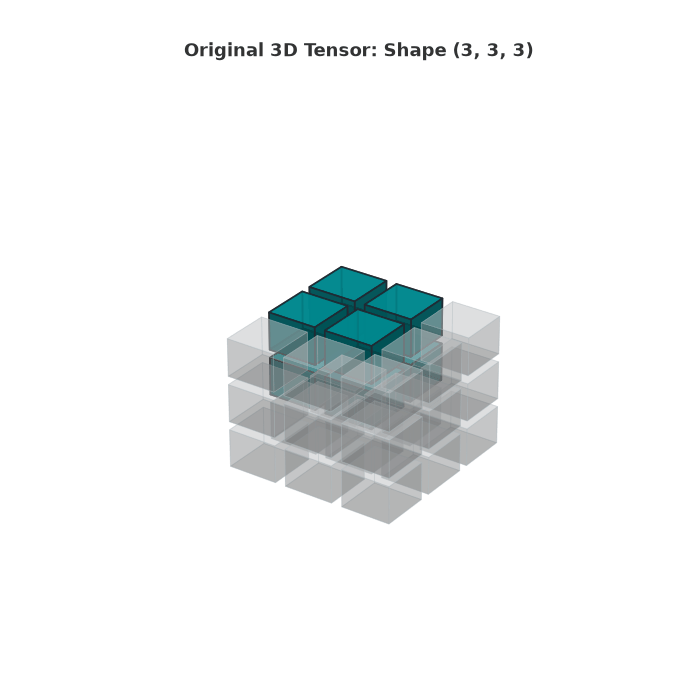
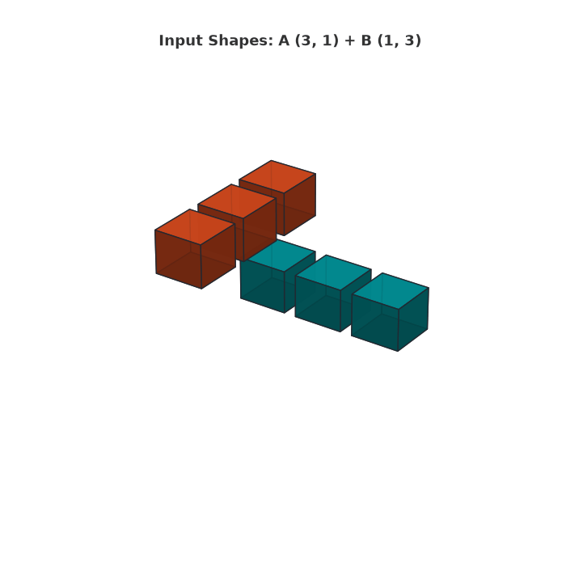
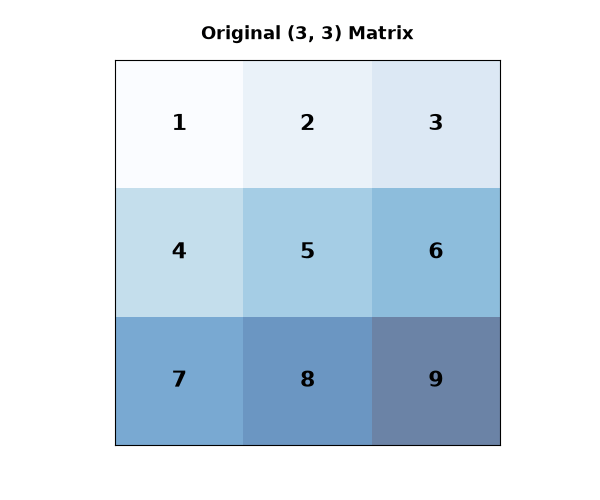

# Ultimate NumPy Visual Cheat Sheet & Guide

> An exhaustive, visual, and zero-fluff reference manual for NumPy fundamentals, operations, and linear algebra.

<p align="center">
  <a href="https://colab.research.google.com/github/AdhamAmgadElSharkawy/numpy-visual-guide/blob/main/learnnumpy.ipynb">
    
  </a>
  
  
  
</p>

---

## Visual Breakdowns (3D Animations)

NumPy arrays operate as multi-dimensional memory buffers. Here is how tensor manipulation, reduction axes, and broadcasting behave under the hood:

<table align="center">
  <tr>
    <td align="center" width="50%">
      <b>3D Tensor Slicing</b><br>
      <code>arr[0:2, 0:2, 1:3]</code>
    </td>
    <td align="center" width="50%">
      <b>Broadcasting Mechanics</b><br>
      <code>(3, 1) + (1, 3) ──> (3, 3)</code>
    </td>
  </tr>
  <tr>
    <td align="center">
      
    </td>
    <td align="center">
      
    </td>
  </tr>
  <tr>
    <td colspan="2" align="center">
      <b>Understanding Axis Reductions</b><br>
      <code>axis=0</code> (down rows ⬇) vs. <code>axis=1</code> (across columns ➡)
    </td>
  </tr>
  <tr>
    <td colspan="2" align="center">
      
    </td>
  </tr>
</table>

---

## Table of Contents

The complete notebook is divided into **14 modular sections**, structured logically from zero to production linear algebra:

* **Module 01:** `NumPy Basics & Array Creation` — Vectors, matrices, shapes, and `.ndim`.
* **Module 02:** `Built-in Initializers & Dtypes` — `zeros`, `linspace` vs. `arange`, and casting.
* **Module 03:** `Indexing & Slicing` — Sub-array extractions, step strides, and dimensions.
* **Module 04:** `Memory: Views vs. Deep Copies` — Memory buffer pointers and mutation hazards.
* **Module 05:** `Reshaping, Transposing & Stacking` — Auto-inferred dims (`-1`), `vstack`, and `hstack`.
* **Module 06:** `Arithmetic & Vectorization` — Vectorized operations and high-speed ufuncs.
* **Module 07:** `Broadcasting Rules` — Dimension stretching mechanics without memory copies.
* **Module 08:** `Aggregate & Statistical Functions` — Axis reductions (`axis=0` vs `axis=1`), `mean`, `std`.
* **Module 09:** `Handling Missing Data` — NaN detection, finite masks, and nan-safe aggregations.
* **Module 10:** `Filtering & Boolean Indexing` — Conditional masking, bitwise operations, and `np.where`.
* **Module 11:** `Sorting & Unique Values` — `np.sort`, argsort index mappings, and frequencies.
* **Module 12:** `Random Numbers (np.random)` — Modern `default_rng`, distributions, and shuffling.
* **Module 13:** `Linear Algebra (np.linalg)` — Dot products (`@`), determinants, matrix inverses, and solvers.
* **Module 14:** `Array File I/O` — Binary serialization (`.npy`) and plain CSV export/import.

---

## Quick Start

### 1. Run in Cloud (Zero Setup)
Click the badge below to run, edit, and experiment directly in your browser:

[](https://colab.research.google.com/github/AdhamAmgadElSharkawy/numpy-visual-guide/blob/main/learnnumpy.ipynb)

### 2. Run Locally

```bash
# Clone the repository
git clone https://github.com/AdhamAmgadElSharkawy/numpy-visual-guide.git
cd numpy-visual-guide

# Install required dependencies
pip install numpy matplotlib pillow

# Open the Jupyter notebook
jupyter notebook learnnumpy.ipynb
